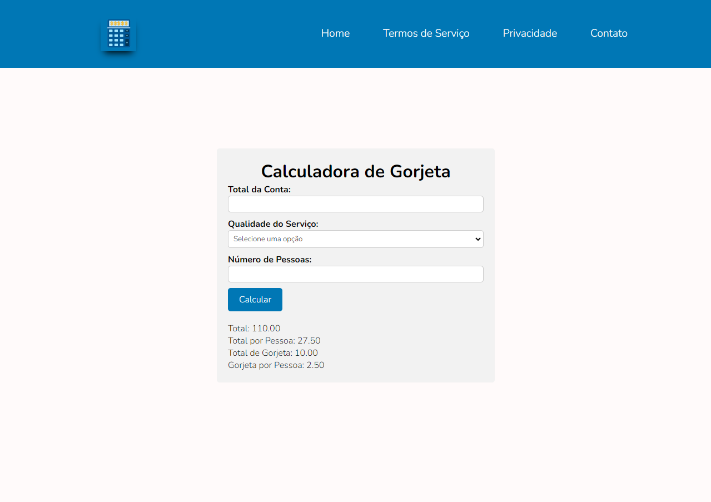

# :rocket: Sobre o Projeto
# GorjCalc
 Uma Calculadora de gorjeta utilizando as seguintes tecnologias javascript, html5 e CSS. A aplicação permite aos garçons calcularem o valor da gorjeta que os clientes devem pagar com base no valor total da conta.

# :rocket: Tecnologias utilizadas

O projeto foi desenvolvido com as seguintes tecnologias:

* HTML 
* CSS
* JavaScript

# :rocket: Acesse o projeto

## [Clique aqui](https://dev-paixao.github.io/GorjCalc/)

# :rocket: Prévia do projeto

